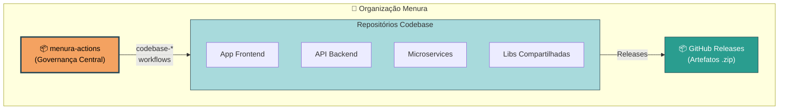
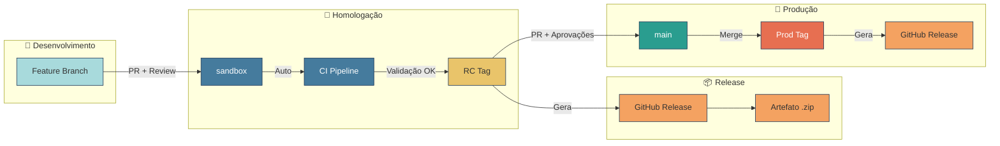
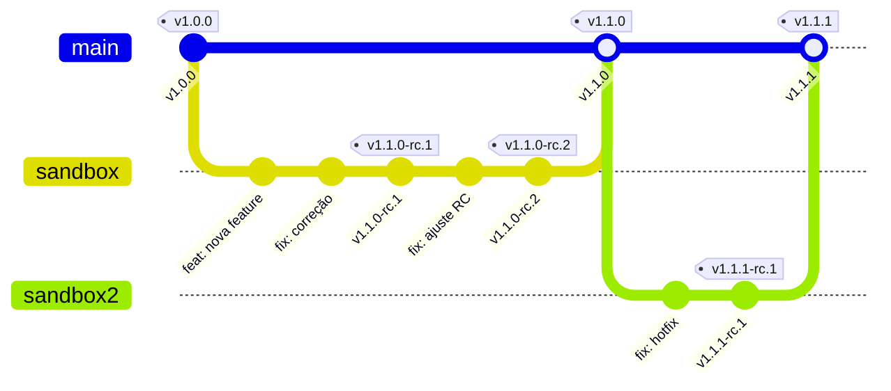
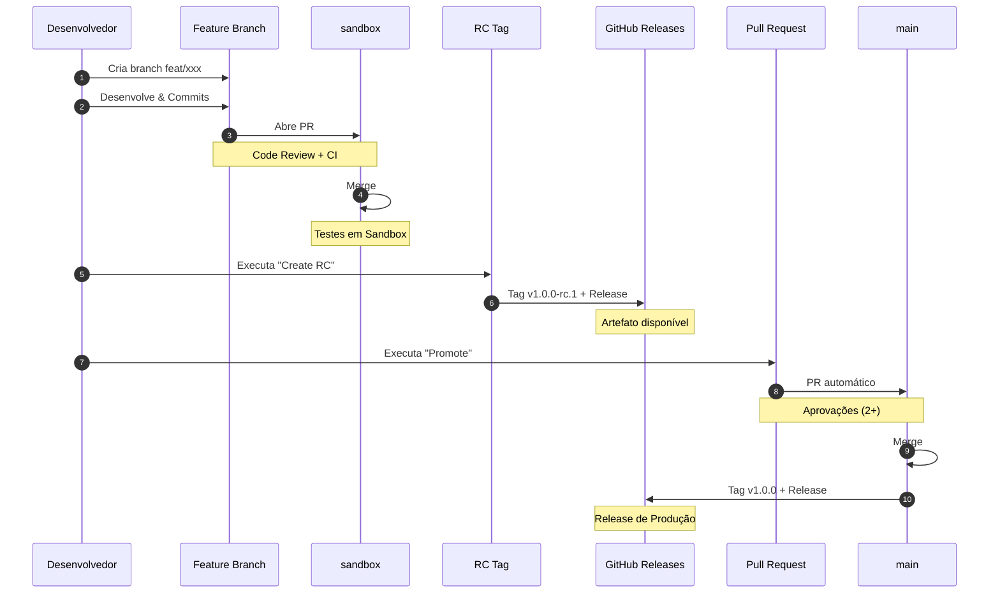

# Menura Actions

Repositório central de governança de pipelines CI/CD para repositórios **Codebase** da organização Menura.

## Visão Geral

O menura-actions fornece workflows reutilizáveis para repositórios que contêm código fonte de aplicações.



> **Nota:** Repositórios de infraestrutura (Terraform/Terragrunt) mantêm suas próprias pipelines localmente.

---

## 🚀 Criando um Novo Repositório?

**Siga nosso guia completo de setup para nascer com todas as melhores práticas:**

👉 **[Setup Completo de Novo Repositório Codebase](docs/tutorials/setup-novo-repositorio.md)** 👈

Este guia inclui:
- ✅ Estrutura de branches (sandbox/main)
- ✅ Workflows CI/CD completos
- ✅ Proteção de branches configurada
- ✅ Preview deploy opcional
- ✅ Code review obrigatório
- ✅ Templates de PR/Issue
- ✅ Documentação básica

**Tempo:** ~45 minutos | **Resultado:** Repositório production-ready

---

## Fluxo Codebase

### Fluxo de Desenvolvimento



### Workflows Disponíveis

| Workflow | Descrição | Trigger |
|----------|-----------|---------|
| [`codebase-ci-node.yml`](.github/workflows/codebase-ci-node.yml) | Lint, testes e build para Node.js | Pull Requests |
| [`codebase-ci-bun.yml`](.github/workflows/codebase-ci-bun.yml) | Lint, testes e build para Bun | Pull Requests |
| [`codebase-release-node.yml`](.github/workflows/codebase-release-node.yml) | Gera artefatos e GitHub Release (Node.js) | Push de tags |
| [`codebase-release-bun.yml`](.github/workflows/codebase-release-bun.yml) | Gera artefatos e GitHub Release (Bun) | Push de tags |
| [`codebase-create-rc.yml`](.github/workflows/codebase-create-rc.yml) | Cria tag de Release Candidate | Manual |
| [`codebase-qualify-rc.yml`](.github/workflows/codebase-qualify-rc.yml) | Qualifica RC como release de produção | Manual |
| [`codebase-validate-tag.yml`](.github/workflows/codebase-validate-tag.yml) | Valida nomenclatura de tags | Push de tags |
| [`codebase-preview-deploy.yml`](.github/workflows/codebase-preview-deploy.yml) | Preview deploy manual de PRs em sandbox | Manual (PRs) |

### Como Usar

#### Projetos Node.js

```yaml
# .github/workflows/ci.yml
name: CI
on:
  pull_request:
    branches: [sandbox, main]
jobs:
  ci:
    uses: iSmart-System/menura-actions/.github/workflows/codebase-ci-node.yml@main
    with:
      node-version: '20'
      artifact-path: 'dist'  # Caminho do build
      # upload-artifacts: false  # Opcional: desabilitar upload em PRs
    secrets: inherit
```

#### Projetos Bun

```yaml
# .github/workflows/ci.yml
name: CI
on:
  pull_request:
    branches: [sandbox, main]
jobs:
  ci:
    uses: iSmart-System/menura-actions/.github/workflows/codebase-ci-bun.yml@main
    with:
      bun-version: 'latest'
      artifact-path: 'dist'  # Caminho do build
      # upload-artifacts: false  # Opcional: desabilitar upload em PRs
    secrets: inherit
```

```yaml
# .github/workflows/release.yml (Node.js)
name: Release
on:
  push:
    tags: ['v*']
jobs:
  release:
    uses: iSmart-System/menura-actions/.github/workflows/codebase-release-node.yml@main
    with:
      artifact-name: 'meu-projeto'
      artifact-path: 'dist'
    secrets: inherit
```

```yaml
# .github/workflows/release.yml (Bun)
name: Release
on:
  push:
    tags: ['v*']
jobs:
  release:
    uses: iSmart-System/menura-actions/.github/workflows/codebase-release-bun.yml@main
    with:
      artifact-name: 'meu-projeto'
      artifact-path: 'dist'
    secrets: inherit
```

### Preview Deploy em PRs (Opcional)

Para habilitar preview deploy manual de PRs no ambiente sandbox:

```yaml
# .github/workflows/ci.yml
on:
  pull_request:
    branches: [sandbox, main]

jobs:
  ci:
    uses: iSmart-System/menura-actions/.github/workflows/codebase-ci-node.yml@main
    with:
      node-version: '20'
      artifact-path: 'dist'
    secrets: inherit

  preview-deploy:
    if: github.event_name == 'pull_request'
    needs: ci
    uses: iSmart-System/menura-actions/.github/workflows/codebase-preview-deploy.yml@main
    with:
      artifact-name: 'meu-app'
      pr-number: ${{ github.event.pull_request.number }}
      repository-name: 'meu-app'
      branch-name: ${{ github.head_ref }}
    secrets:
      dispatch-token: ${{ secrets.PREVIEW_DEPLOY_TOKEN }}
```

> **Requisitos:** Environment `sandbox-preview` com required reviewers + Secret `PREVIEW_DEPLOY_TOKEN`

---

## Branches e Tags

### Branches

| Branch | Propósito |
|--------|-----------|
| `sandbox` | Integração e homologação |
| `main` | Produção |

### Tags

| Padrão | Exemplo | Descrição |
|--------|---------|-----------|
| `v*.*.*-rc.*` | `v1.2.0-rc.1` | Release Candidate |
| `v*.*.*` | `v1.2.0` | Release de Produção |

---

## Nomenclatura SemVer



```
v<MAJOR>.<MINOR>.<PATCH>[-rc.<RC_NUMBER>]
```

| Componente | Quando incrementar |
|------------|-------------------|
| **MAJOR** | Breaking changes |
| **MINOR** | Novas funcionalidades |
| **PATCH** | Correções |
| **RC** | Cada nova RC |

---

## Fluxo Completo de Desenvolvimento



---

## Exemplos

Veja a pasta [`examples/codebase-project/`](examples/codebase-project/) para workflows prontos para copiar em seus projetos.

---

## Documentação

| Seção | Descrição |
|-------|-----------|
| [Tutorials](docs/tutorials/) | Guias de aprendizado passo-a-passo |
| [How-To](docs/how-to/) | Guias práticos para tarefas específicas |
| [Reference](docs/reference/) | Documentação técnica detalhada |
| [Explanation](docs/explanation/) | Conceitos e arquitetura |

---

## Configuração de Secrets

Na maioria dos casos, **nenhum secret adicional** é necessário! O `GITHUB_TOKEN` automático é suficiente.

| Secret | Descrição | Quando Necessário |
|--------|-----------|-------------------|
| `GITHUB_TOKEN` | Token automático do GitHub Actions | **Sempre disponível** (não precisa configurar) |
| `GH_TOKEN` | Personal Access Token | Opcional - apenas se PRs criados precisarem disparar workflows |

> **Sobre secrets de deploy:** O menura-actions **não gerencia deploy**. Secrets como AWS, Vercel, databases, etc. devem ser configurados nos repositórios Architecture Live (Terragrunt).

---

## Configuração de Proteção de Branches

### Branch `sandbox`

```
Require pull request reviews (1 reviewer)
Require status checks to pass
Require branches to be up to date
```

### Branch `main`

```
Require pull request reviews (2 reviewers)
Require status checks to pass
Require branches to be up to date
Restrict who can push (apenas via PR)
```

---

## Licença

Propriedade da Menura/iSmart-System. Uso interno apenas.
