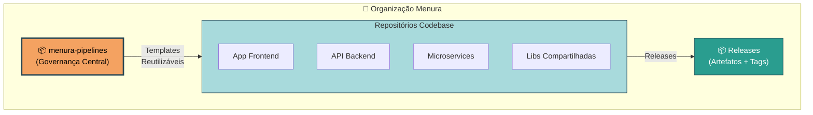
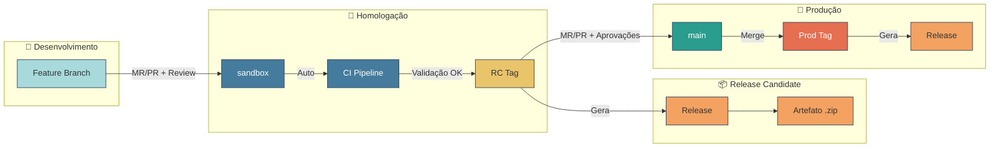
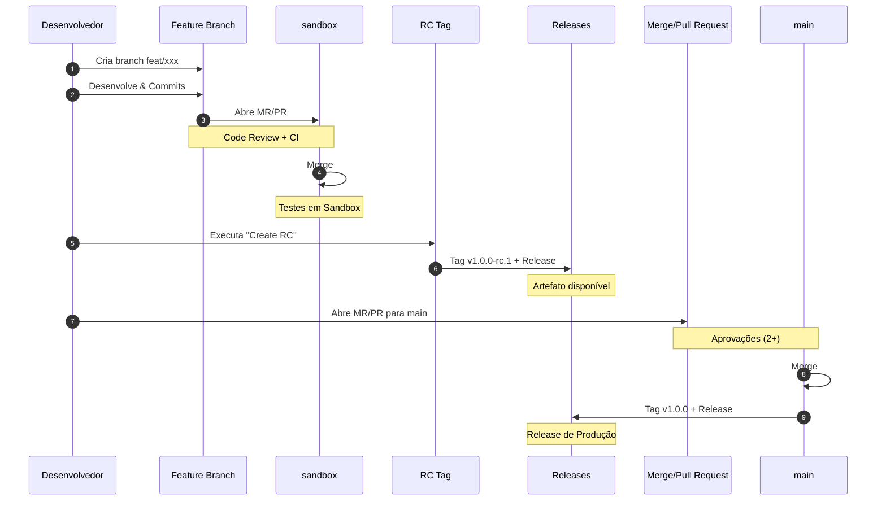
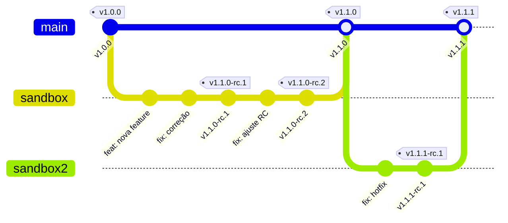

# Menura Pipelines

Repositório central de governança de pipelines CI/CD para repositórios **Codebase** da organização Menura.

**Suporte multi-plataforma:** GitHub Actions e GitLab CI/CD

## Visão Geral

O menura-pipelines fornece templates reutilizáveis de CI/CD para repositórios que contêm código fonte de aplicações, com suporte para **GitHub Actions** e **GitLab CI/CD**.

### Propósito

- Padronizar pipelines de CI/CD para repositórios Codebase
- Automatizar gestão de releases e tags
- Garantir governança e qualidade nas releases
- Gerar artefatos e publicar releases
- Suportar múltiplas plataformas de CI/CD

### Escopo

**✅ Repositórios Codebase:**
- Aplicações frontend (React, Next.js, etc)
- APIs e backends (Node.js, Bun, etc)
- Microservices
- Bibliotecas compartilhadas

**❌ Fora do escopo:**
- Repositórios de infraestrutura (Terraform/Terragrunt)
- Repositórios de documentação pura
- Repositórios de configuração

> **Nota:** Repositórios de infraestrutura mantêm suas próprias pipelines localmente.

---

## 📚 Documentação por Plataforma

Escolha sua plataforma de CI/CD para ver a documentação completa e exemplos:

### GitHub Actions
- 📖 [Documentação e Exemplos](examples/github/)
- 🔧 [Templates Disponíveis](.github/workflows/)
- 📝 Configuração via `workflow_call`

### GitLab CI/CD
- 📖 [Documentação e Exemplos](examples/gitlab/)
- 🔧 [Templates Disponíveis](.gitlab/)
- 📝 Configuração via `include` + `extends`

---

## Arquitetura



---

## Fluxo de Desenvolvimento

### Modelo de Branches

| Branch | Propósito | Proteção |
|--------|-----------|----------|
| `sandbox` | Integração e homologação | ✅ Requer 1 aprovação |
| `main` | Produção | ✅ Requer 2 aprovações |

### Fluxo Padrão



### Ciclo de Vida Completo



---

## Versionamento SemVer

### Formato de Tags

```
v<MAJOR>.<MINOR>.<PATCH>[-rc.<RC_NUMBER>]
```

### Padrões

| Padrão | Exemplo | Descrição | Branch |
|--------|---------|-----------|--------|
| `v*.*.*-rc.*` | `v1.2.0-rc.1` | Release Candidate | `sandbox` |
| `v*.*.*` | `v1.2.0` | Release de Produção | `main` |

### Quando Incrementar

| Componente | Quando incrementar | Exemplo |
|------------|-------------------|---------|
| **MAJOR** | Breaking changes | `v1.0.0` → `v2.0.0` |
| **MINOR** | Novas funcionalidades | `v1.0.0` → `v1.1.0` |
| **PATCH** | Correções de bugs | `v1.0.0` → `v1.0.1` |
| **RC** | Cada nova RC | `v1.0.0-rc.1` → `v1.0.0-rc.2` |

### Exemplo de Fluxo de Versões



---

## Pipelines Padrão

Independente da plataforma, todos os repositórios Codebase devem implementar:

### CI (Continuous Integration)

**Trigger:** MR/PR para `sandbox` ou `main`

**Jobs:**
1. **Lint** - Validação de código (ESLint, Prettier, etc)
2. **Test** - Testes unitários e de integração
3. **Build** - Compilação e geração de artefatos

### Release Management

**Jobs:**
1. **Create RC** - Criar Release Candidate (manual, branch `sandbox`)
2. **Qualify Release** - Qualificar RC para produção (manual, branch `main`)
3. **Release** - Gerar artefatos e publicar release (automático ao criar tag)

### Preview Deploy (Opcional)

**Trigger:** Manual em MR/PR

**Funcionalidade:**
- Deploy temporário em ambiente sandbox
- Aprovação manual nativa
- Auto-cleanup após período configurado

---

## Tech Stacks Suportadas

| Stack | Status | Templates |
|-------|--------|-----------|
| **Node.js** | ✅ Suportado | CI, Release, Preview Deploy |
| **Bun** | ✅ Suportado | CI, Release, Preview Deploy |
| **Python** | 🔜 Planejado | - |
| **Go** | 🔜 Planejado | - |

---

## Governança

### Proteção de Branches

#### Branch `sandbox`
- ✅ Requer MR/PR aprovado (1 reviewer)
- ✅ Requer status checks passando
- ✅ Requer branch atualizada

#### Branch `main`
- ✅ Requer MR/PR aprovado (2 reviewers)
- ✅ Requer status checks passando
- ✅ Requer branch atualizada
- ✅ Apenas merge via MR/PR

### Code Review

- **Sandbox:** 1 aprovação mínima
- **Main:** 2 aprovações mínimas
- **Bloqueios:**
  - Autor não pode aprovar próprio MR/PR
  - Novas aprovações necessárias após novos commits

### Secrets e Variáveis

**Recomendações:**
- Configurar secrets no nível de grupo/organização
- Usar secrets protegidos para branches protegidas
- Marcar secrets como "masked" para não aparecer em logs
- **Não incluir secrets em código ou configurações**

---

## Convenções

### Commits

Seguimos [Conventional Commits](https://www.conventionalcommits.org/):

```
tipo(escopo): descrição

Exemplos:
feat(api): adicionar endpoint de autenticação
fix(ui): corrigir layout responsivo
docs(readme): atualizar instruções de setup
refactor(core): simplificar lógica de validação
```

### Branches

| Tipo | Padrão | Exemplo |
|------|--------|---------|
| Feature | `feat/*` | `feat/user-authentication` |
| Bugfix | `fix/*` | `fix/login-error` |
| Hotfix | `hotfix/*` | `hotfix/critical-security-patch` |

---

## Exemplos Práticos

### GitHub Actions
```bash
# Ver exemplos prontos
examples/github/
├── ci-node.yml                    # CI Node.js
├── ci-bun.yml                     # CI Bun
├── ci-with-preview-node.yml       # CI + Preview Deploy
├── release-node.yml               # Release Node.js
└── release-management.yml         # Release Management
```

📖 [Documentação completa GitHub Actions](examples/github/)

### GitLab CI/CD
```bash
# Ver exemplos prontos
examples/gitlab/
├── ci-node.yml                    # CI Node.js
├── ci-bun.yml                     # CI Bun
├── ci-node-with-preview.yml       # CI + Preview Deploy
└── ci-node-skip-tests.yml         # CI sem lint/tests
```

📖 [Documentação completa GitLab CI/CD](GITLAB.md)

---

## Documentação Adicional

| Seção | Descrição |
|-------|-----------|
| [AGENTS.md](AGENTS.md) | Instruções para agentes de IA (Claude, Copilot, Cursor) |
| [Tutorials](docs/tutorials/) | Guias de aprendizado passo-a-passo |
| [How-To](docs/how-to/) | Guias práticos para tarefas específicas |
| [Reference](docs/reference/) | Documentação técnica detalhada |
| [Explanation](docs/explanation/) | Conceitos e arquitetura |

---

## Migração entre Plataformas

### GitHub → GitLab

Ver [Guia de Migração GitLab](examples/gitlab/#migração-do-github-actions)

**Principais diferenças:**
- `workflow_call` → `include` + `extends`
- `actions/checkout` → Automático
- Aprovação manual → Nativa (`when: manual`)

### GitLab → GitHub

**Principais diferenças:**
- `include` + `extends` → `workflow_call`
- Aprovação manual → Requer action de terceiros ou environments

---

## Suporte

### Issues e Melhorias
- **GitHub:** [iSmart-System/menura-actions/issues](https://github.com/iSmart-System/menura-actions/issues)
- **GitLab:** [m3nura/pipelines/issues](https://gitlab.com/m3nura/pipelines/-/issues)

### Contribuindo
1. Fork o repositório
2. Crie branch `feat/*` ou `fix/*`
3. Faça commits seguindo Conventional Commits
4. Abra MR/PR para `sandbox`
5. Aguarde code review

---

## Licença

Propriedade da Menura/iSmart-System. Uso interno apenas.
