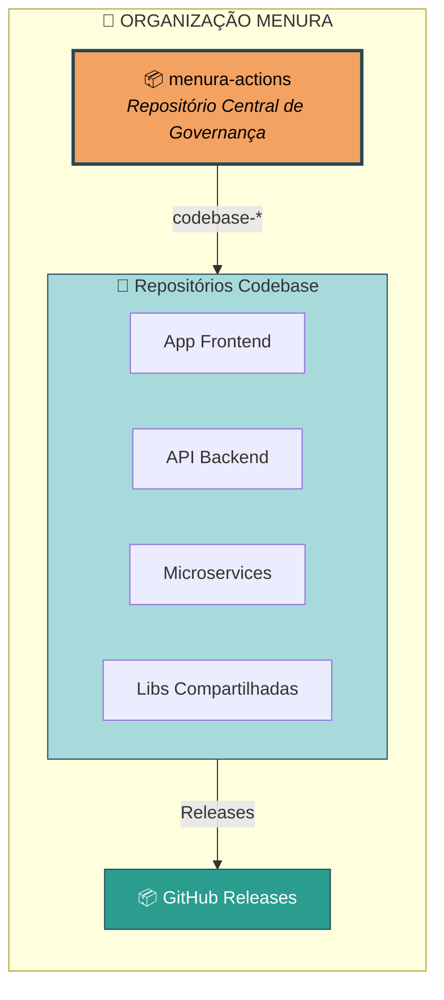
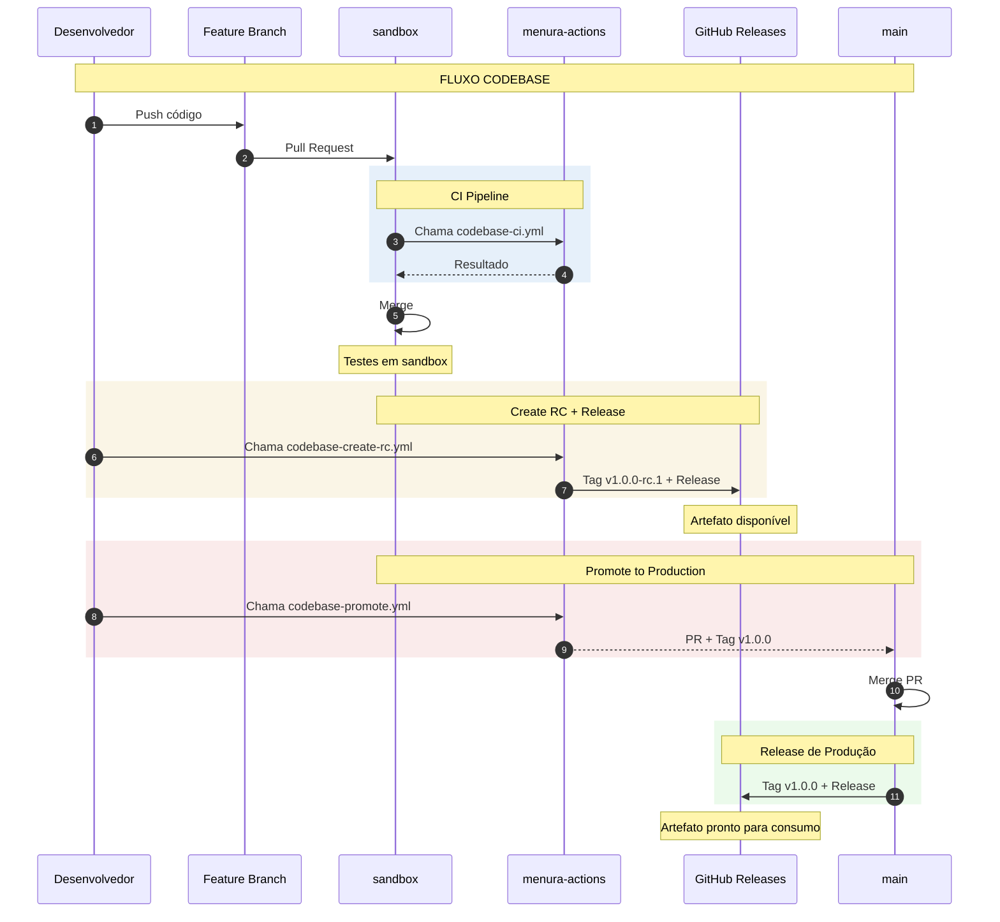
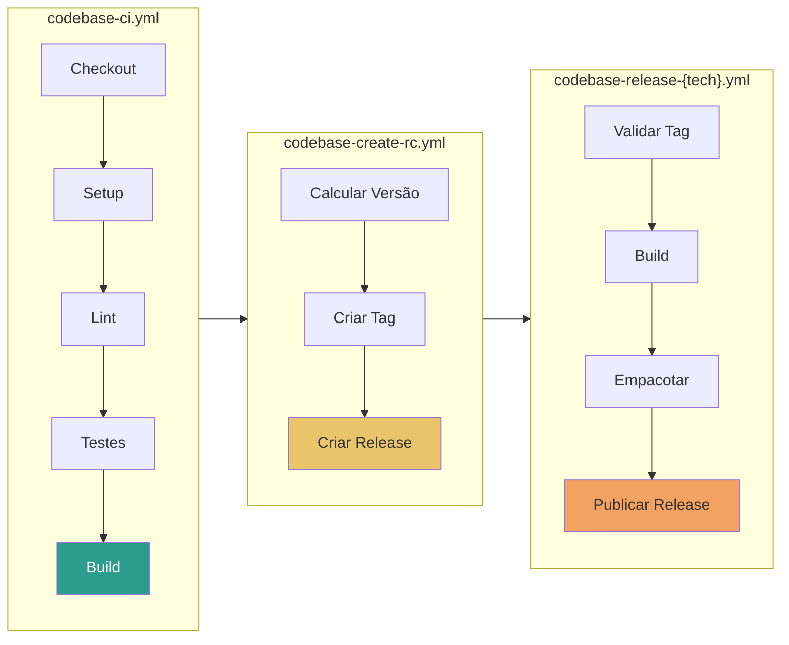
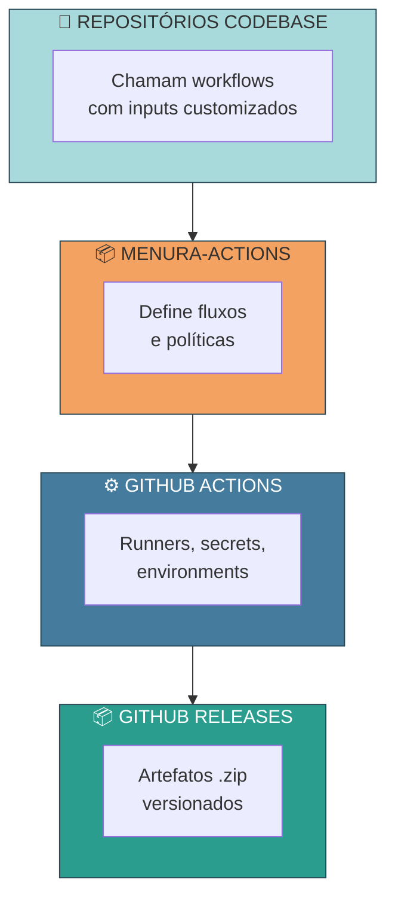

# Arquitetura do menura-actions

Este documento explica a arquitetura geral do sistema de governança de pipelines e como os componentes se relacionam.

---

## Visão Geral

O menura-actions é um **repositório central de governança** que define e padroniza os processos de CI/CD para repositórios **Codebase** da organização Menura.



> **Nota:** Repositórios de infraestrutura (Terraform/Terragrunt) mantêm suas próprias pipelines localmente usando Architecture Live.

---

## Repositórios Codebase

Repositórios que contêm código fonte de aplicações.

| Característica | Descrição |
|----------------|-----------|
| **Propósito** | Desenvolver e empacotar aplicações |
| **Artefatos** | Gera arquivos `.zip` |
| **Publicação** | GitHub Releases |
| **Branches** | `sandbox` (staging) + `main` (production) |
| **Tags** | Release Candidates (`-rc.N`) + Produção |
| **Workflows** | `codebase-*` (centralizados) |

---

## Modelo Hub-and-Spoke

Utilizamos um modelo **hub-and-spoke** (centro e raios):

### Hub (Centro)

O repositório `menura-actions` é o hub que:

- Define workflows padronizados para repos Codebase
- Controla políticas de CI/CD
- Gerencia versões e releases
- Documenta padrões

### Spokes (Raios)

Cada projeto Codebase é um spoke que:

- Consome workflows do hub (`codebase-*`)
- Customiza via inputs
- Mantém código de negócio
- Segue as políticas definidas

### Benefícios

| Aspecto | Benefício |
|---------|-----------|
| **Consistência** | Todos os projetos seguem o mesmo padrão |
| **Manutenção** | Atualização centralizada propaga para todos |
| **Governança** | Políticas aplicadas uniformemente |
| **Onboarding** | Novos projetos começam com padrão pronto |

---

## Fluxo de Dados



---

## Componentes do Sistema

### Workflows



**Princípios:**
- CI: Falhar rápido (fail fast), feedback claro
- Release: Automação completa, rastreabilidade
- RC: Nomenclatura padronizada SemVer

---

## Camadas de Abstração



---

## Pontos de Extensão

### 1. Inputs Customizáveis

Cada projeto pode customizar via inputs:

```yaml
with:
  node-version: '18'
  artifact-path: 'build'
  skip-tests: false
```

### 2. Secrets por Environment

Diferentes credenciais para sandbox/production:

```yaml
environment: production  # Usa secrets de produção
```

### 3. Workflows Locais

Projetos podem ter workflows adicionais:

```
projeto/
├── .github/workflows/
│   ├── ci.yml           # Chama menura-actions
│   ├── release.yml      # Chama menura-actions
│   └── custom.yml       # Workflow local adicional
```

---

## Trade-offs

### Centralização vs. Flexibilidade

| Centralizado | Distribuído |
|--------------|-------------|
| Consistência | Flexibilidade total |
| Governança | Autonomia do time |
| Menos flexível | Inconsistência |
| Single point of change | Manutenção duplicada |

**Nossa escolha:** Centralização com pontos de extensão.

### Simplicidade vs. Completude

| Simples | Completo |
|---------|----------|
| Fácil de usar | Cobre todos os casos |
| Rápido onboarding | Menos workarounds |
| Pode faltar features | Complexidade |

**Nossa escolha:** Começar simples, adicionar conforme necessidade.

---

## Evolução Futura

### Implementado

- [x] Workflows Codebase completos
- [x] Release Candidates automatizados
- [x] GitHub Releases com artefatos

### Planejado

- [ ] Suporte a múltiplas linguagens (Python, Go)
- [ ] Métricas e observabilidade
- [ ] Integração com ferramentas de segurança
- [ ] Multi-stack (além de Node.js)
