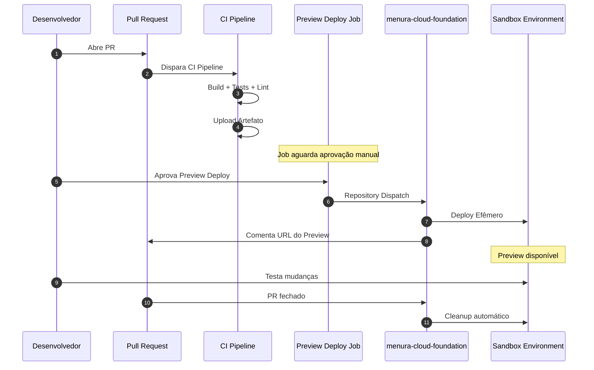

# Como Configurar Preview Deploy em PRs

## Objetivo

Permitir que desenvolvedores façam deploy manual de preview de um PR no ambiente sandbox antes do merge, disparando automaticamente o deploy no repositório de infraestrutura.

## Visão Geral



## Pré-requisitos

### 1. Personal Access Token (PAT)

Crie um PAT com acesso ao repositório `menura-cloud-foundation`:

1. Acesse GitHub Settings → Developer settings → Personal access tokens → Fine-grained tokens
2. Clique em "Generate new token"
3. Configure:
   - **Token name:** `preview-deploy-token`
   - **Expiration:** 1 year (ou conforme política)
   - **Repository access:** Only select repositories
   - Selecione: `iSmart-System/menura-cloud-foundation`
   - **Permissions:**
     - Contents: Read and write
     - Metadata: Read-only
4. Copie o token gerado

### 2. Configurar Secret no Repositório

No repositório do projeto:

1. Settings → Secrets and variables → Actions
2. New repository secret
3. **Name:** `PREVIEW_DEPLOY_TOKEN`
4. **Secret:** Cole o PAT criado

### 3. Criar Environment com Aprovação Manual

1. Settings → Environments → New environment
2. **Name:** `sandbox-preview`
3. Configure deployment protection rules:
   - ✅ Required reviewers
   - Adicione usuários/times que podem aprovar
   - (Opcional) ✅ Prevent self-review
4. Save protection rules

> **Nota:** Required reviewers requer GitHub Pro/Team/Enterprise para repos privados. Para repos públicos, está disponível no free tier.

## Configuração do Workflow

### Node.js

Crie `.github/workflows/ci.yml`:

```yaml
name: CI

on:
  pull_request:
    branches: [sandbox, main]
  push:
    branches: [sandbox, main]

jobs:
  ci:
    uses: iSmart-System/menura-actions/.github/workflows/codebase-ci-node.yml@main
    with:
      node-version: '20'
      artifact-path: 'dist'
      upload-artifacts: true  # Necessário para preview deploy
    secrets: inherit

  preview-deploy:
    name: Preview Deploy (Manual)
    if: github.event_name == 'pull_request'
    needs: ci
    uses: iSmart-System/menura-actions/.github/workflows/codebase-preview-deploy.yml@main
    with:
      artifact-name: 'meu-app'  # Nome do seu projeto
      pr-number: ${{ github.event.pull_request.number }}
      repository-name: 'meu-app'
      branch-name: ${{ github.head_ref }}
    secrets:
      dispatch-token: ${{ secrets.PREVIEW_DEPLOY_TOKEN }}
```

### Bun

Igual ao Node.js, mas use `codebase-ci-bun.yml`:

```yaml
jobs:
  ci:
    uses: iSmart-System/menura-actions/.github/workflows/codebase-ci-bun.yml@main
    with:
      bun-version: 'latest'
      # ... resto igual
```

## Como Usar

### 1. Abrir Pull Request

```bash
git checkout -b feat/nova-funcionalidade
git add .
git commit -m "feat: adicionar nova funcionalidade"
git push origin feat/nova-funcionalidade
```

Abra o PR no GitHub.

### 2. Aguardar CI Pipeline

A pipeline de CI executará automaticamente:
- ✅ Lint
- ✅ Tests
- ✅ Build
- ✅ Upload de artefatos

### 3. Aprovar Preview Deploy (Manual)

Após o CI passar:

1. Acesse a aba **Actions** do PR
2. Localize o job "Preview Deploy (Manual)"
3. Status: **Waiting** (aguardando aprovação)
4. Clique em **Review deployments**
5. Selecione `sandbox-preview`
6. Clique em **Approve and deploy**

### 4. Acompanhar Deploy

O workflow:
1. ✅ Valida inputs
2. ✅ Prepara metadata do artefato efêmero
3. ✅ Dispara `repository_dispatch` para `menura-cloud-foundation`
4. ✅ Comenta no PR com detalhes

### 5. Acessar Preview Environment

Após o deploy no `menura-cloud-foundation`:
- URL do preview será comentada no PR
- Acesse e teste as mudanças
- Preview ID: `pr-{número}`

### 6. Cleanup Automático

Quando o PR for:
- **Merged** → Preview removido automaticamente
- **Closed** → Preview removido automaticamente

## Opções Avançadas

### Customizar Environment Name

```yaml
preview-deploy:
  uses: iSmart-System/menura-actions/.github/workflows/codebase-preview-deploy.yml@main
  with:
    environment: 'sandbox-preview-staging'  # Custom environment
    # ... outros inputs
```

### Customizar Repositório de Infraestrutura

```yaml
preview-deploy:
  uses: iSmart-System/menura-actions/.github/workflows/codebase-preview-deploy.yml@main
  with:
    foundation-repo: 'minha-org/meu-infra-repo'
    # ... outros inputs
```

### Deploy Automático (Sem Aprovação)

Remova o environment ou crie um environment sem required reviewers:

```yaml
preview-deploy:
  uses: iSmart-System/menura-actions/.github/workflows/codebase-preview-deploy.yml@main
  with:
    environment: 'sandbox-preview-auto'  # Environment sem reviewers
    # ... outros inputs
```

## Troubleshooting

| Problema | Causa | Solução |
|----------|-------|---------|
| Job não aparece | `if: github.event_name == 'pull_request'` | Verifique se está em um PR |
| Erro de permissão | PAT sem permissões | Verifique scopes do PAT |
| Não pede aprovação | Environment sem reviewers | Configure required reviewers |
| Deploy não dispara | Secret não configurado | Adicione `PREVIEW_DEPLOY_TOKEN` |
| Artefato não encontrado | `upload-artifacts: false` | Altere para `true` |

## Payload Enviado ao Foundation

O workflow envia o seguinte payload via `repository_dispatch`:

```json
{
  "event_type": "preview-deploy",
  "client_payload": {
    "source_repo": "iSmart-System/meu-app",
    "source_repo_name": "meu-app",
    "pr_number": "123",
    "branch": "feat/nova-funcionalidade",
    "commit_sha": "abc123...",
    "artifact_name": "meu-app-pr-123",
    "artifact_url": "https://github.com/.../actions/runs/...",
    "preview_id": "pr-123",
    "environment": "sandbox",
    "triggered_by": "username"
  }
}
```

## Workflow no menura-cloud-foundation

O repositório de infraestrutura deve ter um workflow que escuta o evento:

```yaml
name: Preview Deploy

on:
  repository_dispatch:
    types: [preview-deploy]

jobs:
  deploy:
    runs-on: ubuntu-latest
    steps:
      - name: Deploy Preview
        run: |
          echo "Deploying ${{ github.event.client_payload.artifact_name }}"
          echo "PR: ${{ github.event.client_payload.pr_number }}"
          # ... lógica de deploy
```

## Boas Práticas

1. **Limite Aprovadores:** Use apenas times/pessoas autorizados
2. **Self-Review Prevention:** Habilite para maior segurança
3. **Cleanup:** Sempre implemente cleanup automático de previews
4. **Monitoramento:** Configure alertas para previews órfãos
5. **Custos:** Monitore custos de recursos efêmeros
6. **Nomenclatura:** Use padrão consistente (`pr-{número}`)
7. **Labels:** Adicione labels Kubernetes para rastreamento
8. **TTL:** Configure timeout para previews antigos (7 dias)

## Segurança

- ✅ PAT com minimal scope (apenas foundation repo)
- ✅ Required reviewers no environment
- ✅ Self-review prevention habilitado
- ✅ Validação de inputs antes do dispatch
- ✅ Secrets via GitHub Secrets (nunca hardcoded)
- ✅ Audit log via GitHub Actions logs

---

*Veja também:*
- [Reference: Preview Deploy Workflow](../reference/workflows.md#codebase-preview-deploy)
- [Configurar Secrets](configure-secrets.md)
